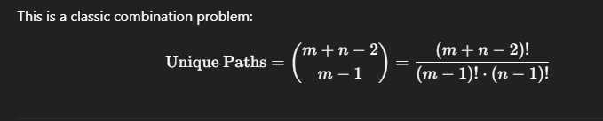

https://leetcode.com/problems/unique-paths/

Yes, there is another more efficient mathematical method based on combinatorics, which avoids using extra space or loops over a matrix.

🔢 Combinatorial Method (Best for Time & Space Efficiency)
To go from the top-left to bottom-right in an m x n grid:

You need to make exactly (m - 1) down moves and (n - 1) right moves, in some order.

So, you make a total of (m + n - 2) moves.

Out of those, choose any (m - 1) (or (n - 1)) moves to be down (or right).

This is a classic combination problem:

​
 
✅ Advantages:
Time Complexity: O(min(m, n)) — due to optimized factorial computation.

Space Complexity: O(1) — uses constant space.

